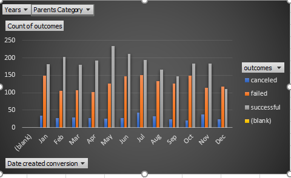

# fundrasing analysis

## Overview of Project
My overview of this project was that it taught me how to collect data
### Purpose
The Purpose was to collect data of fundrasing  compaign
## Analysis and Challenges
The challenges of this project was at first collect and putting the data into it
### Analysis of Outcomes Based on Launch Date

### Analysis of Outcomes Based on Goals

### Challenges and Difficulties Encountered
The challenges and difficulties i eccountered was making the charts
## Results

- What are two conclusions you can draw about the Outcomes based on Launch Date?
The conclusions i can draw were that they all came up after the launch date also that it took a long time for them to come up
- What can you conclude about the Outcomes based on Goals?
  I conclude that the outcomes on goals was and up and down on the line chart
- What are some limitations of this dataset?
Some limitattions of this data set was some data on the organial page i could not edit
- What are some other possible tables and/or graphs that we could create?
Other tables i could of made was an area graph to show other areas of the campaign could of went to.

Ok
